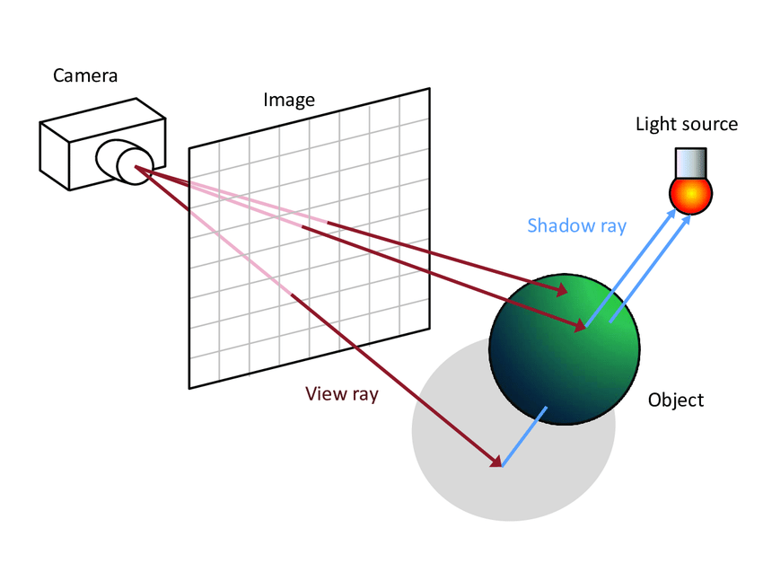
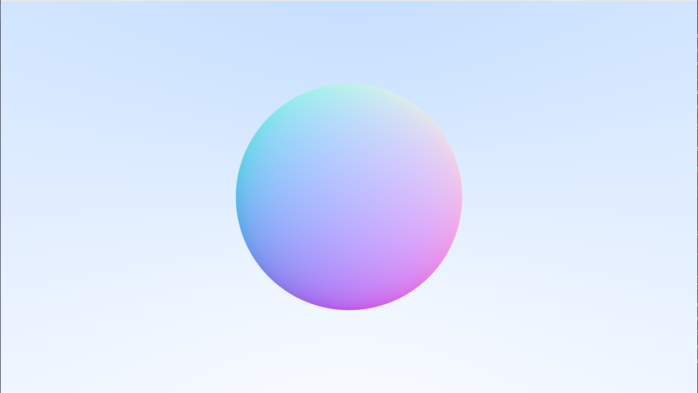

# GPU Ray Tracing in Bevy

A real-time ray tracing implementation using **Bevy's compute shaders**, rendering directly on the GPU. This project translates the principles of *"Ray Tracing in One Weekend"* into a high-performance, parallelized WGSL pipeline.

##  Features

- **Real-time GPU Rendering:** Massive parallelization of ray-pixel calculations using Bevy’s compute shader system.
- **Advanced Material Modeling:**
    - **Lambertian (Diffuse):** Realistic matte surfaces with soft shading.
    - **Metallic:** Reflective surfaces with adjustable fuzziness.
    - **Dielectric:** Transparent materials (glass/water) with refraction and Total Internal Reflection.
- **Customizable Camera:** Full support for view transformations, field of view (FOV) adjustments, and depth of field (defocus blur).
- **Anti-Aliasing:** Multi-sampling per pixel implemented within the shader to produce smooth gradients and eliminate jagged edges.
- **Rust Integration:** Leverages the Bevy engine for efficient resource binding and scene management.

##  Screenshots

### Implementation Logic
The engine uses ray-sphere intersection logic and calculates surface normals to determine shading and geometry mapping in 3D space.

| Ray Tracing Model | Normal Vector Visualization |
| :---: | :---: |
|  |  |

### Material & Physics Testing
The project includes tests for various material properties, including refractive indices for dielectrics and reflective fuzziness for metals.

| Dielectric, Diffuse, & Metallic | High-Sample Anti-Aliasing |
| :---: | :---: |
|  |  |

### Final Scenes
The following renders demonstrate the engine's ability to handle high-density scenes with varying materials and camera angles.


## How It Works

1. **Compute Shader Pipeline:** A compute shader is set up to render directly to a texture on the GPU.
2. **WGSL Kernels:** The core ray tracing algorithm (ray casting, intersection, and coloring) is executed in parallel across GPU cores.
3. **Core Components:**
    - `compute_shader.rs`: Manages the pipeline and GPU resource binding.
    - `camera.rs`: Handles the camera structure and view transformations.
    - `scene.rs`: Manages scene objects and extracts data for the GPU.
    - `compute_shader_example.wgsl`: The shader code performing the actual ray tracing logic.

##  Getting Started

### Requirements
- **Rust** (Stable channel)
- A GPU supporting **Compute Shaders**
- **Cargo** package manager

### Installation
1. Clone the repository:
   ```bash
   git clone [https://github.com/Sur091/GPU-Ray-Tracing.git](https://github.com/Sur091/GPU-Ray-Tracing.git)
   cd GPU-Ray-Tracing
   ```
2. Build and Run
   ```bash
   cargo run --release
   ```
### Acknowledgement
- Inspired by **Peter Shirley**'s "Ray Tracing in One Weekend".
- Built with the Bevy Engine
